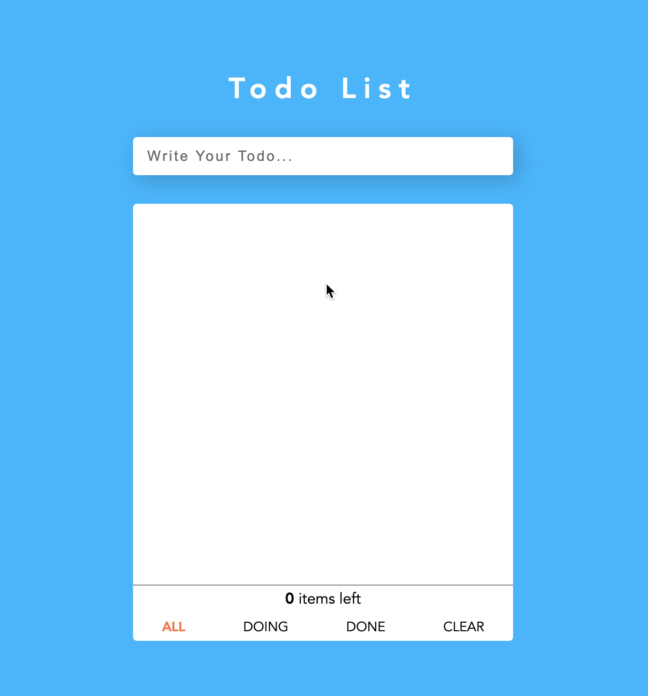

# 유비씨(UVC) 과제: TodoList 구현하기

이 프로젝트는 유비씨(UVC) 과제입니다.

## 기술 스택

이 프로젝트에 사용된 기술은 다음과 같습니다.

- Language: HTML, CSS, Javascript
- Framework: Vue.js
- Project Setup: Vue-cli

## 설치 및 실행

```text
$ git clone https://github.com/junjangsee/vue-todolist.git
$ cd vue-todolist
$ npm install
$ npm run serve
```

## 프로젝트 구조

```text
.
+-- public (페이지가 그려질 파일 구성)
|   +-- index.html
|   +-- favicon.ico
+-- src
|   +-- assets (공통 파일 구성)
|   |   +-- css (CSS 파일 구성)
|   |   |   +-- reset.css (CSS 초기화를 위한 파일)
|   |   +-- images (image 파일 구성)
|   |   |   +-- *.gif, *.svg
|   +-- components (페이지를 구성하는 컴포넌트 구성)
|   |   +-- *.vue
|   +-- App.vue (컴포넌트 최상위 및 공통 로직 구성)
|   +-- main.js (Vue 객체 생성)
+-- etc (기타 프로젝트 파일 구성)
.
```

## 프로젝트 시연

### Preview



### 배포 환경

Production: [https://epic-elion-6adca5.netlify.app/](https://epic-elion-6adca5.netlify.app/)

## 작업 내용

- [Issues](https://github.com/junjangsee/vue-todolist/issues?q=is%3Aissue+is%3Aclosed)
- [Pull Requests](https://github.com/junjangsee/vue-todolist/pulls?q=is%3Apr+is%3Aclosed)
